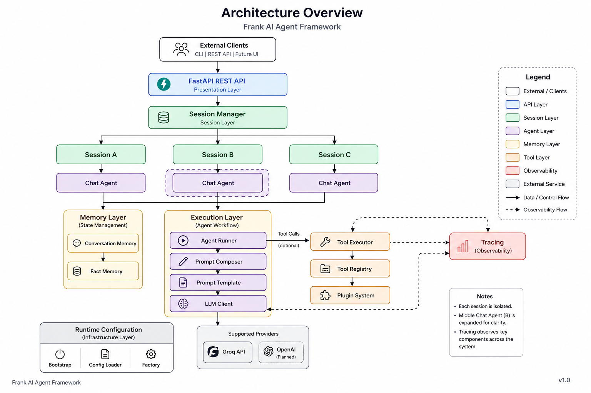
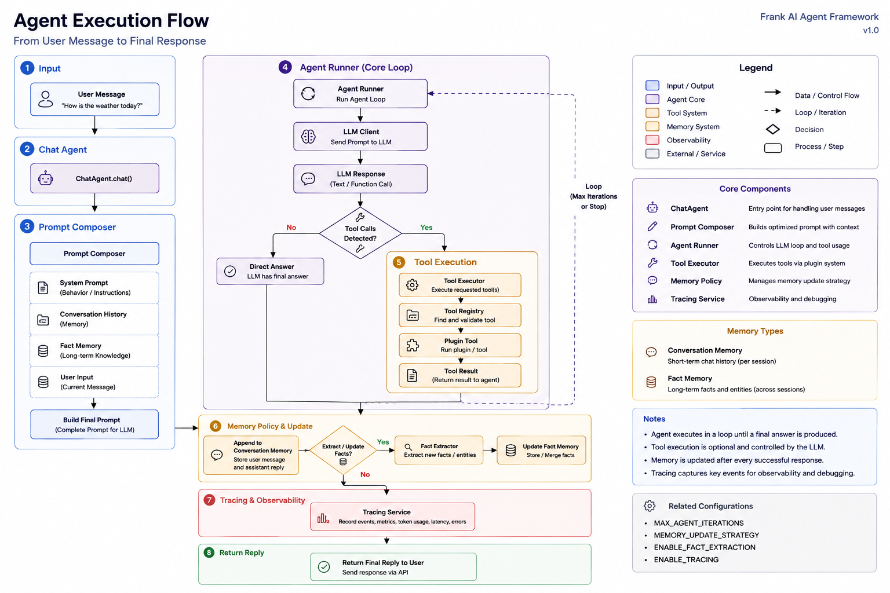
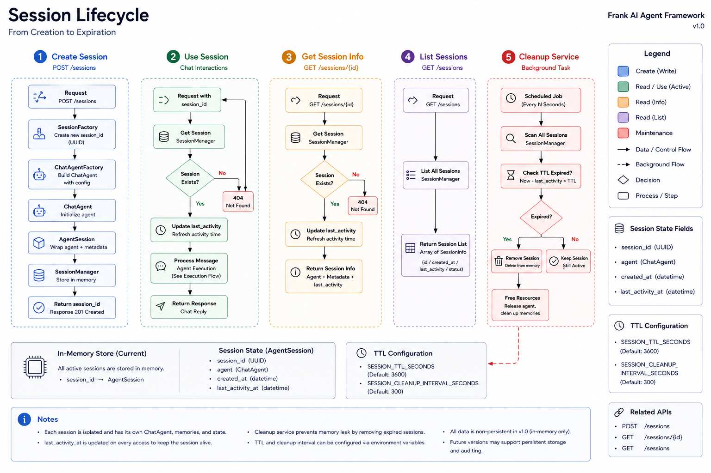

# Frank AI Agent Framework


A modular AI agent framework built with **Python** and **FastAPI** for developing
stateful, extensible, and observable LLM applications.

Frank AI Agent provides a structured foundation for building AI agent services
with isolated sessions, conversation and fact memory, retrieval-augmented
generation, iterative tool execution, plugin-based extensibility, structured
tracing, runtime configuration, and REST APIs.

Rather than coupling these capabilities into a single chat application, the
framework separates agent execution, memory, tools, sessions, configuration,
and observability into independent components that can evolve separately.

## Why Frank AI Agent?

Modern LLM applications require more than sending a prompt to a model and
returning its response.

As an AI application grows, it needs to manage concerns such as:

- Conversation state across multiple interactions
- Isolated sessions for different users or clients
- Long-term facts alongside short-term conversation history
- Tool calling and iterative agent execution
- Extensible tool and plugin registration
- Runtime configuration and dependency construction
- Tracing and observability across LLM and tool operations
- API exposure and containerized deployment

Frank AI Agent was built to explore these problems through a clean,
modular architecture where each responsibility is represented by a
dedicated component.

## Key Features

### Stateful Agent Sessions

Each session owns an independent agent instance with isolated conversation
history and fact memory.

The session layer provides:

- Unique session identifiers
- Session creation, retrieval, and deletion
- Sliding expiration based on activity
- Automatic cleanup of expired sessions
- Isolated agent state between sessions

### Conversation & Fact Memory

The framework separates short-term conversation history from structured
long-term facts.

- Sliding-window conversation memory keeps recent interactions within a
  configurable history limit
- Fact memory stores structured information extracted from user messages
- Memory policies control which facts are allowed to persist
- Prompt composition combines system instructions, remembered facts, and
  conversation history before agent execution

### Retrieval-Augmented Generation

The framework supports retrieval-augmented generation using a configurable
local knowledge base.

The retrieval system provides:

- Recursive knowledge directory loading
- TXT, Markdown, and text-based PDF document support
- Recursive boundary-aware text chunking with paragraph, newline, word, and character fallbacks
- Configurable fixed-size text chunking remains available
- Local sentence-transformer embeddings
- In-memory vector search using cosine similarity
- Source metadata preservation
- Configurable top-k semantic retrieval
- Retrieval policies for controlling when knowledge lookup is performed

Retrieved knowledge is injected into the prompt only when the active retrieval
policy determines that external context is required.

### Iterative Tool Calling

The agent runtime supports multi-step tool execution rather than a single
LLM request.

When the model requests a tool, the framework:

1. Detects the tool call
2. Validates and executes the requested tool
3. Appends the tool result to the conversation
4. Sends the updated context back to the LLM
5. Continues until a final response is produced

A configurable iteration limit prevents uncontrolled execution loops.

### Plugin-Based Tool Architecture

Tools can be added through a plugin-based architecture without modifying
the core agent runtime.

The tool system provides:

- Centralized tool registration
- Tool schema generation for the LLM
- Runtime tool execution
- Configurable plugin loading
- Separation between tool definitions and agent orchestration

### Structured Tracing & Observability

Agent execution is instrumented with structured lifecycle events.

Tracing covers:

- Agent execution
- LLM requests
- Tool execution
- Parent-child span relationships
- Execution duration and metadata

This makes it possible to inspect how a request moves through the agent
runtime and identify failures or performance bottlenecks.

### REST API with FastAPI

The framework exposes its agent runtime through a versioned REST API.

The API provides:

- Session management endpoints
- Stateful chat requests
- Health checks
- Centralized exception handling
- OpenAPI schema generation
- Swagger UI and ReDoc documentation

### Configuration-Driven Runtime

Runtime behavior is separated from implementation details through
configuration models and environment variables.

Configuration includes:

- LLM provider settings
- Agent iteration limits
- Conversation memory limits
- Retrieval and knowledge base settings
- Session TTL and cleanup intervals
- Retry policies
- Tool plugins
- Tracing exporters
- Prompt settings

### Testing & Code Quality

The project includes automated tests and static analysis for core
components and integration boundaries.

Development tooling includes:

- Pytest
- Ruff
- Pyright
- Dependency-injected test doubles and fake implementations

## Architecture Overview



Frank AI Agent is organized around clearly separated runtime responsibilities.

The request flow starts at the FastAPI layer, where clients interact with
versioned REST endpoints. Session management then resolves an isolated
`ChatAgent` instance for each active session.

Each agent owns its own conversation memory and fact memory, while execution
is delegated to the agent runtime. The runtime coordinates prompt composition,
LLM requests, optional tool execution, and iterative reasoning until a final
response is produced.

Cross-cutting concerns such as tracing, configuration, and dependency
construction are kept separate from the agent's business flow.

### Core Layers

| Layer | Responsibility |
|---|---|
| API | Exposes health, session, and chat endpoints through FastAPI |
| Session | Manages isolated agent sessions and session lifetime |
| Agent | Coordinates prompt composition, memory, retrieval, and agent execution |
| Memory | Stores conversation history and structured user facts |
| Retrieval | Loads, indexes, and retrieves external knowledge for prompt augmentation |
| Tool System | Registers, exposes, and executes plugin-based tools |
| Tracing | Records agent, LLM, and tool lifecycle events |
| Configuration | Loads runtime settings and constructs dependencies |

## Agent Execution Flow



Each chat request passes through a structured execution pipeline that separates
memory processing, prompt construction, agent orchestration, and tool execution.

1. The `ChatAgent` receives and validates the user message.
2. The fact extractor identifies structured facts from the message.
3. The memory policy determines which extracted facts should be persisted.
4. The retrieval policy determines whether external knowledge should be queried.
5. When retrieval is enabled for the request, the retriever performs semantic
   search against the indexed knowledge base.
6. The prompt composer combines the system prompt, remembered facts,
   conversation history, retrieved context, and the current user message.
7. The `AgentRunner` sends the composed messages to the configured LLM client.
8. If the model requests a tool, the tool executor resolves and executes it
   through the tool registry.
9. The tool result is appended to the execution context and sent back to the
   LLM for another iteration.
10. Execution continues until the model produces a final response or the
    configured iteration limit is reached.
11. The completed user and assistant messages are stored in conversation memory.
12. Structured trace events record the agent, LLM, and tool execution lifecycle.

### Tool Execution Loop

Tool calls are handled iteratively rather than as a separate one-shot request:

```text
LLM Request
    │
    ▼
Tool Call?
    │
    ├── No ──► Final Response
    │
    └── Yes
         │
         ▼
    Tool Executor
         │
         ▼
     Tool Result
         │
         └────────► Next LLM Iteration
```

This allows the agent to execute tools and feed their results back into the
model before producing the final response.

## Session Lifecycle



Each session owns an independent `ChatAgent`, keeping conversation history and
fact memory isolated from other sessions.

### Session Creation

When a new session is requested:

1. The `SessionManager` generates a unique session ID.
2. The `ChatAgentFactory` creates a new agent instance.
3. Independent conversation memory and fact memory are created for the agent.
4. The current timestamp is assigned to both `created_at` and
   `last_activity_at`.
5. The resulting `AgentSession` is stored in the in-memory session store.

### Session Activity

Retrieving an active session updates its `last_activity_at` timestamp while
preserving its original `created_at` value and agent instance.

This creates a sliding expiration model: active sessions remain available as
long as they continue receiving requests.

### Session Expiration

A session is considered expired when:

```text
current_time >= last_activity_at + SESSION_TTL_SECONDS
```

Expired sessions are periodically removed from the in-memory session store by
the background cleanup task.

The cleanup behavior is configurable through:

```env
SESSION_TTL_SECONDS=3600
SESSION_CLEANUP_INTERVAL_SECONDS=300
```

With the default configuration, inactive sessions expire after one hour and
the cleanup task checks for expired sessions every five minutes.

### Current Storage Model

Session state is currently stored in memory.

This keeps the runtime simple and makes session isolation explicit, while the
session management abstraction leaves room for a persistent or distributed
session store in a future version.

## Retrieval-Augmented Generation (RAG)

Frank AI Agent supports retrieval-augmented generation using a configurable
local knowledge base.

### Supported Knowledge Sources

The knowledge path can point to either a supported file or a directory.

Supported document types:

- `.txt`
- `.md`
- `.pdf`

Directories are scanned recursively for supported documents.

PDF support currently uses text extraction and does not perform OCR on scanned
or image-only PDFs.

### Knowledge Ingestion Pipeline

```text
Knowledge Files
      │
      ▼
Document Loaders
      │
      ▼
Documents
      │
      ▼
Text Splitter
      │
      ▼
Chunks
      │
      ▼
Embedding Provider
      │
      ▼
In-Memory Vector Store
      │
      ▼
VectorStoreRetriever
```

Documents are split into overlapping chunks and converted into vector
embeddings using a local sentence-transformer model. The resulting embeddings
are stored in an in-memory vector store and searched using semantic similarity.

Source metadata is preserved throughout the pipeline. PDF documents also retain
their page number when available.

### Retrieval Flow

```text
User Message
     │
     ▼
Retrieval Policy
     │
     ├── Skip ────────────────┐
     │                        │
     └── Retrieve             │
            │                 │
            ▼                 │
     VectorStoreRetriever     │
            │                 │
            ▼                 │
     Retrieved Context        │
            │                 │
            └─────────┬───────┘
                      ▼
               Prompt Composer
                      │
                      ▼
                 Agent Runner
```

The retrieval policy determines whether knowledge lookup is required for the
current request. Retrieved contexts are added to the composed prompt before
agent execution.

### Example Knowledge Directory

```text
knowledge/
├── session.md
├── deployment.txt
└── architecture.pdf
```

### Runtime Behavior

Retrieval is optional and disabled by default.

When disabled, the runtime uses `NoOpRetriever` and `NeverRetrievePolicy`,
preserving the standard agent behavior without initializing the embedding
pipeline.

When enabled, supported knowledge documents are indexed during application
startup.

The runtime fails fast when the configured knowledge path does not exist or no
supported knowledge can be indexed. Individual documents that fail to load are
skipped and reported through warning logs while valid documents continue to be
processed.

When retrieval is enabled, `KeywordRetrievalPolicy` determines whether the
current query should trigger semantic retrieval.

If the query contains one of the configured trigger keywords, the retriever
searches the indexed knowledge base and adds the retrieved context to the
composed prompt.

Queries that do not match any configured trigger keyword skip retrieval and
continue through the standard agent flow.

Keyword-based routing is intentionally simple and may miss semantically related
queries that do not contain one of the configured trigger keywords.

#### Source Attribution and Citation Guard

Retrieved knowledge preserves source metadata throughout the retrieval pipeline.

For PDF documents, page metadata is also preserved so that generated responses
can reference both the source document and page number.

Each retrieved context with source metadata receives a trusted citation token
such as `[source:1]`. The language model is instructed to cite retrieved
knowledge using only these tokens instead of generating source names or page
numbers directly.

Example context presented to the model:

```text
[source:1] Source: knowledge/architecture.pdf (page 1)
The application layer uses FastAPI.
```

Example model response:

```text
The application layer uses FastAPI. [source:1]
```

Before the response is returned or stored in conversation memory,
`CitationGuard` replaces each valid token with source metadata from the
retrieved context:

```text
The application layer uses FastAPI.
[Source: knowledge/architecture.pdf (page 1)]
```

Unknown citation tokens, malformed tokens, and direct source labels are
rejected. When citation validation fails, the unverified response is discarded
and replaced with a safe response. Only the safe response is stored in
conversation memory.

Text and Markdown documents include the source path without a page number.

#### Grounded Retrieval Fallback

When a retrieval policy triggers knowledge retrieval but the retriever returns
no usable context, such as when no results satisfy the configured similarity
threshold, `ChatAgent` returns a deterministic grounded fallback without
invoking the language model.

This prevents the model from answering document-specific questions when no
trusted retrieval evidence is available. The fallback response is stored in
conversation memory so that the API response and session history remain
consistent.

Queries that do not trigger retrieval continue through the standard agent flow
and can still use general conversation and tool calling.

## Tech Stack

| Category | Technology |
|---|---|
| Language | Python 3.13 |
| API Framework | FastAPI |
| LLM Provider | Groq API |
| Data Validation | Pydantic |
| HTTP Client | HTTPX |
| Testing | Pytest |
| Linting & Formatting | Ruff |
| Static Type Checking | Pyright |
| Containerization | Docker & Docker Compose |
| Embeddings | Sentence Transformers |
| Vector Search | In-Memory Cosine Similarity |
| Document Processing | TXT, Markdown, PDF (PyPDF) |

## Project Structure

The project is organized by responsibility so that agent execution,
infrastructure, configuration, and API concerns remain separated.

```text
Frank-AI-Agent/
├── app/
│   ├── agent/              # Agent orchestration and execution
│   ├── api/                # FastAPI application and REST routes
│   ├── clients/            # LLM client implementations
│   ├── config_loaders/     # Environment configuration loading
│   ├── config_models/      # Typed runtime configuration
│   ├── extractors/         # Structured fact extraction
│   ├── memory/             # Conversation and fact memory
│   ├── policies/           # Memory persistence policies
│   ├── prompts/            # Prompt templates and composition
│   ├── retrieval/          # RAG ingestion, embeddings, indexing, and retrieval
│   ├── session/            # Session lifecycle management
│   ├── tools/              # Tool registry, execution, and plugins
│   └── tracing/            # Structured tracing and exporters
│
├── knowledge/              # Local retrieval knowledge sources
├── assets/
│   └── images/             # Architecture documentation
│
├── tests/
│   ├── unit/               # Component-level tests
│   ├── integration/        # Cross-component behavior tests
│   ├── fakes/              # Test doubles
│   └── helpers/            # Shared testing utilities
│
├── Dockerfile
├── docker-compose.yml
├── requirements.txt
├── requirements-dev.txt
└── run_api.py

## Quick Start

### 1. Clone the Repository

```bash
git clone https://github.com/franktsaodev/Frank-AI-Agent.git
cd Frank-AI-Agent
```

### 2. Create a Virtual Environment

```bash
python -m venv .venv
```

Activate the virtual environment.

**Windows PowerShell**

```powershell
.venv\Scripts\Activate.ps1
```

**macOS / Linux**

```bash
source .venv/bin/activate
```

### 3. Install Dependencies

```bash
pip install -r requirements.txt
```

For development, install the additional development dependencies:

```bash
pip install -r requirements-dev.txt
```

### 4. Configure Environment Variables

Copy the example environment file:

**Windows PowerShell**

```powershell
Copy-Item .env.example .env
```

**macOS / Linux**

```bash
cp .env.example .env
```

Then configure your Groq API key in `.env`:

```env
GROQ_API_KEY=your_groq_api_key
```

Other runtime settings can be customized through the same `.env` file.

### 5. Start the API

```bash
python run_api.py
```

The API will be available at:

```text
http://localhost:8000
```

### 6. Open the API Documentation

Once the server is running, interactive API documentation is available at:

```text
Swagger UI: http://localhost:8000/docs
ReDoc:      http://localhost:8000/redoc
OpenAPI:    http://localhost:8000/openapi.json
```

You can use Swagger UI to create a session and start interacting with the
agent without writing a separate client.

## Configuration

Frank AI Agent uses environment-based configuration to keep runtime settings
separate from application code.

Start by copying `.env.example` to `.env`, then customize the values for your
environment.

### LLM Provider

| Variable | Default | Description |
|---|---|---|
| `GROQ_API_KEY` | — | Groq API authentication key |
| `GROQ_MODEL` | `openai/gpt-oss-120b` | Groq model used by the agent |

### Retry Policy

| Variable | Default | Description |
|---|---|---|
| `GROQ_RETRY_MAX_ATTEMPTS` | `3` | Maximum number of LLM request attempts |
| `GROQ_RETRY_INITIAL_DELAY_SECONDS` | `1` | Initial delay before retrying a failed request |
| `GROQ_RETRY_BACKOFF_MULTIPLIER` | `2.0` | Multiplier used for retry backoff |

### Agent

| Variable | Default | Description |
|---|---|---|
| `AGENT_MAX_ITERATIONS` | `10` | Maximum number of iterations in a single agent execution |

### Memory

| Variable | Default | Description |
|---|---|---|
| `MEMORY_MAX_HISTORY_ROUNDS` | `2` | Maximum number of conversation rounds retained in short-term memory |
| `MEMORY_ALLOWED_KEYS` | `user_name,favorite_music,occupation` | Fact keys allowed to persist in fact memory |

### Retrieval

| Variable | Default | Description |
|---|---|---|
| `RETRIEVAL_ENABLED` | `false` | Enables or disables retrieval-augmented generation |
| `RETRIEVAL_KNOWLEDGE_PATH` | `knowledge` | File or directory used as the knowledge source |
| `RETRIEVAL_CHUNK_SIZE` | `500` | Maximum text chunk size used during indexing |
| `RETRIEVAL_CHUNK_OVERLAP` | `50` | Overlap between adjacent text chunks |
| `RETRIEVAL_TOP_K` | `5` | Maximum number of semantic search results returned |
| `RETRIEVAL_MIN_SCORE` | `-1.0` | Minimum cosine similarity required to keep a retrieval result (`-1.0` to `1.0`) |
| `RETRIEVAL_EMBEDDING_MODEL` | `sentence-transformers/all-MiniLM-L6-v2` | Sentence-transformer model used to generate embeddings |
| `RETRIEVAL_TRIGGER_KEYWORDS` | `documentation,manual,session,deployment,architecture` | Comma-separated keywords that trigger knowledge retrieval |

### Prompt

| Variable | Default | Description |
|---|---|---|
| `PROMPT_NAME` | `system_prompt.txt` | System prompt template file |
| `PROMPT_LANGUAGE` | `Traditional Chinese` | Default response language configured for the prompt |

### Logging

| Variable | Default | Description |
|---|---|---|
| `LOG_LEVEL` | `INFO` | Application log level (`DEBUG`, `INFO`, `WARNING`, `ERROR`, or `CRITICAL`) |

Third-party libraries such as Hugging Face, Sentence Transformers, HTTPX,
and file-locking utilities are limited to warning-level output to keep runtime
logs readable.

### Tracing

| Variable | Default | Description |
|---|---|---|
| `TRACE_LOGGING_ENABLED` | `true` | Enables trace logging |
| `TRACE_JSON_FILE_PATH` | `logs/traces.jsonl` | Output path for structured JSON trace events |

### Tool Plugins

| Variable | Default | Description |
|---|---|---|
| `ENABLED_TOOL_PLUGINS` | `core` | Comma-separated tool plugins loaded during application bootstrap |

### Application

| Variable | Default | Description |
|---|---|---|
| `APP_SERVICE_NAME` | `Frank AI Agent` | Service name exposed by runtime information and health checks |
| `APP_VERSION` | `1.1.0` | Application version exposed by the running service |

### Session

| Variable | Default | Description |
|---|---|---|
| `SESSION_TTL_SECONDS` | `3600` | Maximum inactivity period before a session expires |
| `SESSION_CLEANUP_INTERVAL_SECONDS` | `300` | Interval between background expired-session cleanup cycles |

> [!NOTE]
> `GROQ_API_KEY` must be configured before using the Groq-backed agent.
> Do not commit your `.env` file or API keys to version control.

## REST API

Frank AI Agent exposes a session-based REST API under `/api/v1`.

Interactive documentation is available through Swagger UI at `/docs`.

### Endpoints

| Method | Endpoint | Description |
|---|---|---|
| `GET` | `/health` | Check service health and runtime information |
| `POST` | `/api/v1/sessions` | Create a new agent session |
| `GET` | `/api/v1/sessions/{session_id}` | Get session information |
| `DELETE` | `/api/v1/sessions/{session_id}` | Delete a session |
| `POST` | `/api/v1/sessions/{session_id}/chat` | Send a message to the session agent |
| `GET` | `/api/v1/sessions/{session_id}/history` | Get conversation history |
| `DELETE` | `/api/v1/sessions/{session_id}/history` | Clear conversation history |

### 1. Create a Session

```http
POST /api/v1/sessions
```

Response:

```json
{
  "session_id": "session-123"
}
```

A newly created session receives its own `ChatAgent` instance and isolated
memory state.

### 2. Send a Chat Message

```http
POST /api/v1/sessions/{session_id}/chat
Content-Type: application/json
```

Request:

```json
{
  "message": "My name is Frank."
}
```

Response:

```json
{
  "response": "Nice to meet you, Frank."
}
```

Optional request metadata can also be supplied:

```json
{
  "message": "Hello",
  "metadata": {
    "request_id": "request-123"
  }
}
```

The API automatically adds protected runtime metadata such as the request
source and session ID before passing the request to the agent.

### 3. Continue the Conversation

Use the same `session_id` for subsequent requests:

```json
{
  "message": "What is my name?"
}
```

Because the session retains its own conversation and fact memory, the agent
can use information remembered during previous interactions.

### 4. Get Conversation History

```http
GET /api/v1/sessions/{session_id}/history
```

Example response:

```json
{
  "session_id": "session-123",
  "messages": [
    {
      "role": "user",
      "content": "Hello"
    },
    {
      "role": "assistant",
      "content": "Hi Frank!"
    }
  ]
}
```

### 5. Get Session Information

```http
GET /api/v1/sessions/{session_id}
```

The response includes:

```json
{
  "session_id": "session-123",
  "created_at": "2026-08-06T03:00:00Z",
  "last_activity_at": "2026-08-06T03:30:00Z",
  "message_count": 2
}
```

### 6. Clear Conversation History

```http
DELETE /api/v1/sessions/{session_id}/history
```

Response:

```json
{
  "cleared": true
}
```

### 7. Delete a Session

```http
DELETE /api/v1/sessions/{session_id}
```

Response:

```json
{
  "deleted": true
}
```

Deleting the session removes the complete in-memory session, including its
agent and associated memory state.

## Docker

Frank AI Agent can be built and run as a container using Docker or
Docker Compose.

### Docker Compose

The simplest way to start the service is:

```bash
docker compose up --build
```

Docker Compose will:

- Build the application image
- Load runtime configuration from `.env`
- Expose the API on port `8000`
- Run the container health check
- Restart the service automatically unless it is explicitly stopped

Once the container is running:

```text
API:        http://localhost:8000
Swagger UI: http://localhost:8000/docs
Health:     http://localhost:8000/health
```

Run the service in the background:

```bash
docker compose up --build -d
```

Check container status:

```bash
docker compose ps
```

View logs:

```bash
docker compose logs -f api
```

Stop the service:

```bash
docker compose down
```

### Build the Docker Image Manually

```bash
docker build -t frank-ai-agent:1.1.0 .
```

### Run the Image Manually

**Windows PowerShell**

```powershell
docker run --rm `
  --name frank-ai-agent `
  -p 8000:8000 `
  --env-file .env `
  -e APP_VERSION=1.1.0 `
  frank-ai-agent:1.1.0
```

**macOS / Linux**

```bash
docker run --rm \
  --name frank-ai-agent \
  -p 8000:8000 \
  --env-file .env \
  -e APP_VERSION=1.1.0 \
  frank-ai-agent:1.1.0
```

> [!NOTE]
> PowerShell uses the backtick (`) for line continuation.
> Bash and similar shells use the backslash (`\`).

### Container Health Check

The Docker Compose configuration periodically checks:

```text
GET /health
```

A healthy container indicates that the FastAPI application is running and
responding on port `8000`.

The container health check uses an extended startup grace period so that the
initial embedding-model download does not immediately mark the service as
unhealthy.

### Hugging Face Model Cache

When retrieval is enabled, the configured sentence-transformer model is loaded
during application startup.

Docker Compose persists the Hugging Face model cache using a named volume:

```text
huggingface-cache
```

The cache is mounted at:

```text
/home/app/.cache/huggingface
```

The first retrieval-enabled startup may take longer while the embedding model
is downloaded. Subsequent container recreations reuse the cached model and
start significantly faster.

The cache is preserved when running:

```bash
docker compose down
```

To remove the cache volume explicitly:

```bash
docker compose down -v
```

## Testing & Code Quality

Frank AI Agent includes automated tests and static analysis to verify both
individual components and cross-component behavior.

### Run the Test Suite

Install the development dependencies first:

```bash
pip install -r requirements-dev.txt
```

Then run all tests:

```bash
pytest
```

The test suite is organized into two main levels:

```text
tests/
├── unit/           # Individual component behavior
├── integration/    # Cross-component behavior and isolation
├── fakes/          # Reusable test doubles
└── helpers/        # Shared testing utilities
```

Unit tests cover components such as:

- Agent execution
- Memory and fact storage
- Prompt composition
- Tool registration and execution
- Plugin loading
- Configuration loading
- Session management
- FastAPI routes and exception handling
- Structured tracing
- Retrieval, document loading, embeddings, and vector search

Integration tests verify behavior across component boundaries, including
session isolation, independent agent memory, semantic retrieval pipelines,
and conditional retrieval routing.

### Linting

Run Ruff to check the codebase:

```bash
ruff check .
```

Automatically fix supported linting issues:

```bash
ruff check . --fix
```

### Formatting

Check formatting:

```bash
ruff format --check .
```

Format the codebase:

```bash
ruff format .
```

### Static Type Checking

Run Pyright:

```bash
pyright
```

### Recommended Validation

Before committing changes, run:

```bash
pytest
ruff check .
ruff format --check .
pyright
```

This validation workflow helps catch behavioral regressions, style issues,
formatting differences, and type errors before changes are committed.

## Roadmap

Frank AI Agent v1.0.0 establishes the core architecture for building stateful,
tool-enabled AI agent applications.

### v1.0 — Core Framework

- [x] Modular agent architecture
- [x] Conversation memory
- [x] Structured fact memory
- [x] Memory policies
- [x] Iterative tool calling
- [x] Plugin-based tool architecture
- [x] Structured tracing
- [x] Environment-based configuration
- [x] Session isolation
- [x] Session expiration and background cleanup
- [x] FastAPI REST API
- [x] Centralized API exception handling
- [x] Docker and Docker Compose deployment
- [x] Unit and integration testing

### v1.1 — Retrieval-Augmented Generation

- [x] Document abstraction and loaders
- [x] TXT and Markdown knowledge ingestion
- [x] Text-based PDF ingestion
- [x] Recursive knowledge directory loading
- [x] Fixed-size text chunking
- [x] Sentence-transformer embeddings
- [x] In-memory vector search
- [x] Semantic knowledge retrieval
- [x] Source metadata preservation
- [x] Retrieval policy abstraction
- [x] ChatAgent retrieval integration
- [x] Configurable retrieval runtime

### v1.2 — Retrieval Quality and Reliability

- [x] Keyword-based conditional retrieval
- [x] Source attribution with PDF page metadata
- [x] Trusted citation token validation and hallucinated citation guard
- [x] Minimum similarity threshold
- [x] Grounded fallback for empty retrieval results
- [x] Recursive boundary-aware text chunking

### Future Development

- [ ] Streaming responses
- [ ] Persistent session storage
- [ ] Redis-backed distributed sessions
- [ ] Model Context Protocol (MCP) integration
- [ ] Multi-agent orchestration
- [ ] Additional LLM providers
- [ ] Metrics and monitoring
- [ ] CI/CD with GitHub Actions

## License

This project is licensed under the MIT License.
See the `LICENSE` file for details.