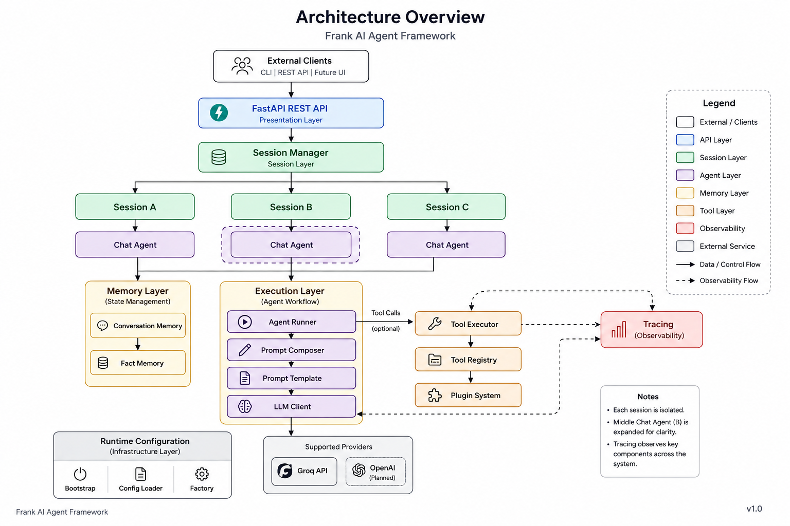
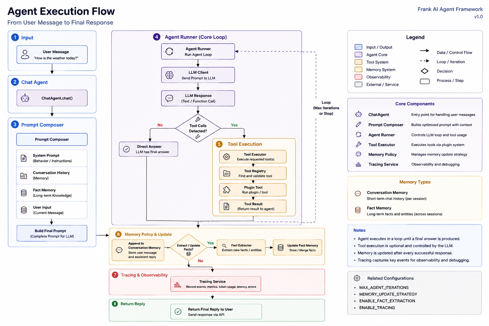
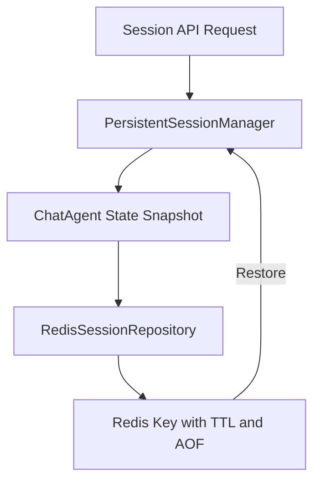

# Frank AI Agent Framework


A modular AI agent framework built with **Python** and **FastAPI** for developing
stateful, extensible, and observable LLM applications.

Frank AI Agent provides a structured foundation for building AI agent services
with isolated sessions, conversation and fact memory, retrieval-augmented
generation, iterative tool execution, plugin-based extensibility, structured
tracing, runtime configuration, and REST APIs.

Rather than coupling these capabilities into a single chat application, the
framework separates agent execution, memory, tools, sessions, configuration,
and observability into independent components that can evolve separately.

## Why Frank AI Agent?

Modern LLM applications require more than sending a prompt to a model and
returning its response.

As an AI application grows, it needs to manage concerns such as:

- Conversation state across multiple interactions
- Isolated sessions for different users or clients
- Long-term facts alongside short-term conversation history
- Tool calling and iterative agent execution
- Extensible tool and plugin registration
- Runtime configuration and dependency construction
- Tracing and observability across LLM and tool operations
- API exposure and containerized deployment

Frank AI Agent was built to explore these problems through a clean,
modular architecture where each responsibility is represented by a
dedicated component.

## Key Features

### Stateful Agent Sessions

Each session owns an independent agent instance with isolated conversation
history and fact memory.

The session layer provides:

- Unique session identifiers
- Session creation, retrieval, and deletion
- Sliding expiration based on activity
- Automatic cleanup of expired sessions
- Isolated agent state between sessions

### Conversation & Fact Memory

The framework separates short-term conversation history from structured
long-term facts.

- Sliding-window conversation memory keeps recent interactions within a
  configurable history limit
- Fact memory stores structured information extracted from user messages
- Memory policies control which facts are allowed to persist
- Prompt composition combines system instructions, remembered facts, and
  conversation history before agent execution

### Retrieval-Augmented Generation

The framework supports retrieval-augmented generation using a configurable
local knowledge base.

The retrieval system provides:

- Recursive knowledge directory loading
- TXT, Markdown, and text-based PDF document support
- Recursive boundary-aware text chunking with paragraph, newline, word, and character fallbacks
- Configurable fixed-size text chunking remains available
- Local sentence-transformer embeddings
- In-memory vector search using cosine similarity
- Source metadata preservation
- Configurable top-k semantic retrieval
- Retrieval policies for controlling when knowledge lookup is performed

Retrieved knowledge is injected into the prompt only when the active retrieval
policy determines that external context is required.

### Iterative Tool Calling

The agent runtime supports multi-step tool execution rather than a single
LLM request.

When the model requests a tool, the framework:

1. Detects the tool call
2. Validates and executes the requested tool
3. Appends the tool result to the conversation
4. Sends the updated context back to the LLM
5. Continues until a final response is produced

A configurable iteration limit prevents uncontrolled execution loops.

### Plugin-Based Tool Architecture

Tools can be added through a plugin-based architecture without modifying
the core agent runtime.

The tool system provides:

- Centralized tool registration
- Tool schema generation for the LLM
- Runtime tool execution
- Configurable plugin loading
- Separation between tool definitions and agent orchestration

### Structured Tracing & Observability

Agent execution is instrumented with structured lifecycle events.

Tracing covers:

- Agent execution
- LLM requests
- Tool execution
- Parent-child span relationships
- Execution duration and metadata

This makes it possible to inspect how a request moves through the agent
runtime and identify failures or performance bottlenecks.

### REST API with FastAPI

The framework exposes its agent runtime through a versioned REST API.

The API provides:

- Session management endpoints
- Stateful chat requests
- Health checks
- Centralized exception handling
- OpenAPI schema generation
- Swagger UI and ReDoc documentation

### Configuration-Driven Runtime

Runtime behavior is separated from implementation details through
configuration models and environment variables.

Configuration includes:

- LLM provider settings
- Agent iteration limits
- Conversation memory limits
- Retrieval and knowledge base settings
- Session TTL and cleanup intervals
- Retry policies
- Tool plugins
- Tracing exporters
- Prompt settings

### Testing & Code Quality

The project includes automated tests and static analysis for core
components and integration boundaries.

Development tooling includes:

- Pytest
- Ruff
- Pyright
- Dependency-injected test doubles and fake implementations

## Architecture Overview



Frank AI Agent is organized around clearly separated runtime responsibilities.

The request flow starts at the FastAPI layer, where clients interact with
versioned REST endpoints. Session management then resolves an isolated
`ChatAgent` instance for each active session.

Each agent owns its own conversation memory and fact memory, while execution
is delegated to the agent runtime. The runtime coordinates prompt composition,
LLM requests, optional tool execution, and iterative reasoning until a final
response is produced.

Cross-cutting concerns such as tracing, configuration, and dependency
construction are kept separate from the agent's business flow.

### Core Layers

| Layer         | Responsibility                                                           |
| ------------- | ------------------------------------------------------------------------ |
| API           | Exposes health, session, and chat endpoints through FastAPI              |
| Session       | Manages isolated agent sessions and session lifetime                     |
| Agent         | Coordinates prompt composition, memory, retrieval, and agent execution   |
| Memory        | Stores conversation history and structured user facts                    |
| Retrieval     | Loads, indexes, and retrieves external knowledge for prompt augmentation |
| Tool System   | Registers, exposes, and executes plugin-based tools                      |
| Tracing       | Records agent, LLM, and tool lifecycle events                            |
| Configuration | Loads runtime settings and constructs dependencies                       |

## Agent Execution Flow



Each chat request passes through a structured execution pipeline that separates
memory processing, prompt construction, agent orchestration, and tool execution.

1. The `ChatAgent` receives and validates the user message.
2. The fact extractor identifies structured facts from the message.
3. The memory policy determines which extracted facts should be persisted.
4. The retrieval policy determines whether external knowledge should be queried.
5. When retrieval is enabled for the request, the retriever performs semantic
   search against the indexed knowledge base.
6. The prompt composer combines the system prompt, remembered facts,
   conversation history, retrieved context, and the current user message.
7. The `AgentRunner` sends the composed messages to the configured LLM client.
8. If the model requests a tool, the tool executor resolves and executes it
   through the tool registry.
9. The tool result is appended to the execution context and sent back to the
   LLM for another iteration.
10. Execution continues until the model produces a final response or the
    configured iteration limit is reached.
11. The completed user and assistant messages are stored in conversation memory.
12. Structured trace events record the agent, LLM, and tool execution lifecycle.

### Tool Execution Loop

Tool calls are handled iteratively rather than as a separate one-shot request:

```text
LLM Request
    │
    ▼
Tool Call?
    │
    ├── No ──► Final Response
    │
    └── Yes
         │
         ▼
    Tool Executor
         │
         ▼
     Tool Result
         │
         └────────► Next LLM Iteration
```

This allows the agent to execute tools and feed their results back into the
model before producing the final response.

## Session Lifecycle


```mermaid
flowchart TD
    A["Session API Request"] --> B["PersistentSessionManager"]
    B --> C["ChatAgent State Snapshot"]
    C --> D["RedisSessionRepository"]
    D --> E["Redis Key with TTL and AOF"]
    E -->|Restore| B
```

Each session owns an independent `ChatAgent`, keeping conversation history and
fact memory isolated from other sessions. Session snapshots are persisted in
Redis so they can be restored after API process or container restarts.

### Session Creation

When a new session is requested:

1. The `PersistentSessionManager` generates a unique session ID.
2. The `ChatAgentFactory` creates a new agent instance.
3. Independent conversation memory and fact memory are created for the agent.
4. The current timestamp is assigned to both `created_at` and
   `last_activity_at`.
5. The agent exports a versioned state snapshot containing messages and facts.
6. The resulting stored session is encoded as JSON and written to Redis with
   the configured expiration time.

### Session Activity

Retrieving a session loads its stored snapshot from Redis, recreates its
`ChatAgent`, preserves its original `created_at` value, and refreshes both
`last_activity_at` and the Redis TTL.

Successful synchronous chats, completed streaming chats, and history-clearing
operations save the updated agent state back to Redis. A streaming response is
only marked as completed after the updated session has been persisted.

This creates a sliding expiration model: active sessions remain available as
long as they continue receiving requests.

Each stored session has a revision that starts at `0`. Reading a session
atomically refreshes its activity timestamp and Redis TTL without increasing
the revision. State-changing writes check the revision that was read and
increase it only when the write succeeds. If another request has already
updated the session, the stale request receives HTTP `409` with
`session_conflict`. A streaming chat emits an SSE `error` event instead of
`completed` if its final save conflicts.

When a chat stream fails or ends before completion, the frontend removes
provisional messages, reloads the latest saved conversation history, and
restores the submitted text to the composer. The user can inspect the saved
conversation before manually retrying. If history cannot be loaded, the
frontend asks the user to reload before retrying.

If a chat request returns `404`, or reloading history after a failed stream
returns `404`, the frontend creates a replacement session, clears the old
conversation, and keeps the submitted text in the composer for manual
resending. If the replacement cannot be created, the draft remains available
and the error is shown.

Existing version 1 session snapshots remain readable and are migrated to
version 2 when session activity is refreshed.

### Session Expiration

A session expires when its Redis key reaches the configured inactivity limit:

```text
current_time >= last_activity_at + SESSION_TTL_SECONDS
```

Redis removes expired session keys automatically through its native TTL
mechanism. The persistent session manager therefore does not need to scan or
delete expired sessions itself.

The expiration behavior is configured through:

```env
SESSION_TTL_SECONDS=3600
```

With the default configuration, inactive sessions expire after one hour.
Successful session reads and writes refresh that expiration period.

### Redis-Backed Storage

Session state is stored through `SessionRepositoryProtocol`, with
`RedisSessionRepository` used by the application runtime.

Each stored session contains:

- The session ID
- Creation and last-activity timestamps
- A versioned schema identifier
- Conversation history
- Extracted fact memory
- Tool-call message data
- A revision used to detect concurrent updates

Redis persistence allows sessions to survive API restarts and makes the same
session data accessible to multiple API instances using the same Redis
deployment. Docker Compose enables Redis AOF persistence with `appendfsync`
set to `everysec`.

## Retrieval-Augmented Generation (RAG)

Frank AI Agent supports retrieval-augmented generation using a configurable
local knowledge base.

### Supported Knowledge Sources

The knowledge path can point to either a supported file or a directory.

Supported document types:

- `.txt`
- `.md`
- `.pdf`

Directories are scanned recursively for supported documents.

PDF support currently uses text extraction and does not perform OCR on scanned
or image-only PDFs.

### Knowledge Ingestion Pipeline

```text
Knowledge Files
      │
      ▼
Document Loaders
      │
      ▼
Documents
      │
      ▼
Text Splitter
      │
      ▼
Chunks
      │
      ▼
Embedding Provider
      │
      ▼
In-Memory Vector Store
      │
      ▼
VectorStoreRetriever
```

Documents are split into overlapping chunks and converted into vector
embeddings using a local sentence-transformer model. The resulting embeddings
are stored in an in-memory vector store and searched using semantic similarity.

Source metadata is preserved throughout the pipeline. PDF documents also retain
their page number when available.

### Retrieval Flow

```text
User Message
     │
     ▼
Retrieval Policy
     │
     ├── Skip ────────────────┐
     │                        │
     └── Retrieve             │
            │                 │
            ▼                 │
     VectorStoreRetriever     │
            │                 │
            ▼                 │
     Retrieved Context        │
            │                 │
            └─────────┬───────┘
                      ▼
               Prompt Composer
                      │
                      ▼
                 Agent Runner
```

The retrieval policy determines whether knowledge lookup is required for the
current request. Retrieved contexts are added to the composed prompt before
agent execution.

### Example Knowledge Directory

```text
knowledge/
├── session.md
├── deployment.txt
└── architecture.pdf
```

### Runtime Behavior

Retrieval is optional and disabled by default.

When disabled, the runtime uses `NoOpRetriever` and `NeverRetrievePolicy`,
preserving the standard agent behavior without initializing the embedding
pipeline.

When enabled, supported knowledge documents are indexed during application
startup.

The runtime fails fast when the configured knowledge path does not exist or no
supported knowledge can be indexed. Individual documents that fail to load are
skipped and reported through warning logs while valid documents continue to be
processed.

When retrieval is enabled, `KeywordRetrievalPolicy` determines whether the
current query should trigger semantic retrieval.

If the query contains one of the configured trigger keywords, the retriever
searches the indexed knowledge base and adds the retrieved context to the
composed prompt.

Queries that do not match any configured trigger keyword skip retrieval and
continue through the standard agent flow.

Keyword-based routing is intentionally simple and may miss semantically related
queries that do not contain one of the configured trigger keywords.

#### Source Attribution and Citation Guard

Retrieved knowledge preserves source metadata throughout the retrieval pipeline.

For PDF documents, page metadata is also preserved so that generated responses
can reference both the source document and page number.

Each retrieved context with source metadata receives a trusted citation token
such as `[source:1]`. The language model is instructed to cite retrieved
knowledge using only these tokens instead of generating source names or page
numbers directly.

Example context presented to the model:

```text
[source:1] Source: knowledge/architecture.pdf (page 1)
The application layer uses FastAPI.
```

Example model response:

```text
The application layer uses FastAPI. [source:1]
```

Before the response is returned or stored in conversation memory,
`CitationGuard` replaces each valid token with source metadata from the
retrieved context:

```text
The application layer uses FastAPI.
[Source: knowledge/architecture.pdf (page 1)]
```

Unknown citation tokens, malformed tokens, and direct source labels are
rejected. When citation validation fails, the unverified response is discarded
and replaced with a safe response. Only the safe response is stored in
conversation memory.

Text and Markdown documents include the source path without a page number.

#### Grounded Retrieval Fallback

When a retrieval policy triggers knowledge retrieval but the retriever returns
no usable context, such as when no results satisfy the configured similarity
threshold, `ChatAgent` returns a deterministic grounded fallback without
invoking the language model.

This prevents the model from answering document-specific questions when no
trusted retrieval evidence is available. The fallback response is stored in
conversation memory so that the API response and session history remain
consistent.

Queries that do not trigger retrieval continue through the standard agent flow
and can still use general conversation and tool calling.

#### Retrieval Quality Evaluation

The semantic retrieval integration suite includes a fixed evaluation baseline
for relevant, paraphrased, and irrelevant queries.

Relevant queries must achieve 100% Recall@3 by returning the expected evidence
within the top three results. Irrelevant queries must achieve a 100% rejection
rate after minimum similarity filtering.

This quality gate detects regressions when changing the embedding model,
similarity threshold, chunking strategy, or retrieval implementation.

## Tech Stack

| Category             | Technology                                   |
| -------------------- | -------------------------------------------- |
| Languages            | Python 3.13, TypeScript                      |
| API Framework        | FastAPI                                      |
| Frontend             | React, Vite                                  |
| LLM Provider         | Groq API                                     |
| Data Validation      | Pydantic                                     |
| HTTP Clients         | HTTPX, Fetch API                             |
| Testing              | Pytest, Vitest, jsdom, React Testing Library |
| Linting & Formatting | Ruff, ESLint                                 |
| Static Type Checking | Pyright, TypeScript                          |
| Web Server           | Nginx                                        |
| Containerization     | Docker & Docker Compose                      |
| Embeddings           | Sentence Transformers                        |
| Vector Search        | In-Memory Cosine Similarity                  |
| Document Processing  | TXT, Markdown, PDF (PyPDF)                   |

## Project Structure

The project is organized by responsibility so that agent execution,
infrastructure, configuration, and API concerns remain separated.

```text
Frank-AI-Agent/
├── .github/
│   └── workflows/
│       └── ci.yml          # Backend, frontend, and container CI
│
├── app/
│   ├── agent/              # Agent orchestration and execution
│   ├── api/                # FastAPI application and REST routes
│   ├── clients/            # LLM client implementations
│   ├── config_loaders/     # Environment configuration loading
│   ├── config_models/      # Typed runtime configuration
│   ├── extractors/         # Structured fact extraction
│   ├── memory/             # Conversation and fact memory
│   ├── policies/           # Memory persistence policies
│   ├── prompts/            # Prompt templates and composition
│   ├── retrieval/          # RAG ingestion, embeddings, indexing, and retrieval
│   ├── session/            # Session lifecycle management
│   ├── tools/              # Tool registry, execution, and plugins
│   └── tracing/            # Structured tracing and exporters
│
├── frontend/
│   ├── src/                # React UI, API client, session, and storage modules
│   ├── Dockerfile          # Multi-stage frontend container build
│   └── nginx.conf          # Static hosting and FastAPI reverse proxy
│
├── knowledge/              # Local retrieval knowledge sources
├── assets/
│   └── images/             # Architecture documentation
│
├── tests/
│   ├── unit/               # Component-level tests
│   ├── integration/        # Cross-component behavior tests
│   ├── fakes/              # Test doubles
│   └── helpers/            # Shared testing utilities
│
├── Dockerfile
├── docker-compose.yml
├── requirements.txt
├── requirements-dev.txt
└── run_api.py
```

## Quick Start

### 1. Clone the Repository

```bash
git clone https://github.com/franktsaodev/Frank-AI-Agent.git
cd Frank-AI-Agent
```

### 2. Create a Virtual Environment

```bash
python -m venv .venv
```

Activate the virtual environment.

**Windows PowerShell**

```powershell
.venv\Scripts\Activate.ps1
```

**macOS / Linux**

```bash
source .venv/bin/activate
```

### 3. Install Dependencies

```bash
pip install -r requirements.txt
```

For development, install the additional development dependencies:

```bash
pip install -r requirements-dev.txt
```

### 4. Configure Environment Variables

Copy the example environment file:

**Windows PowerShell**

```powershell
Copy-Item .env.example .env
```

**macOS / Linux**

```bash
cp .env.example .env
```

Then configure your Groq API key in `.env`:

```env
GROQ_API_KEY=your_groq_api_key
```

Other runtime settings can be customized through the same `.env` file.

### 5. Start the API

```bash
python run_api.py
```

The API will be available at:

```text
http://localhost:8000
```

### 6. Open the API Documentation

Once the server is running, interactive API documentation is available at:

```text
Swagger UI: http://localhost:8000/docs
ReDoc:      http://localhost:8000/redoc
OpenAPI:    http://localhost:8000/openapi.json
```

You can use Swagger UI to create a session and start interacting with the
agent without writing a separate client.

## Configuration

Frank AI Agent uses environment-based configuration to keep runtime settings
separate from application code.

Start by copying `.env.example` to `.env`, then customize the values for your
environment.

### LLM Provider

| Variable       | Default               | Description                  |
| -------------- | --------------------- | ---------------------------- |
| `GROQ_API_KEY` | —                     | Groq API authentication key  |
| `GROQ_MODEL`   | `openai/gpt-oss-120b` | Groq model used by the agent |

### Retry Policy

| Variable                           | Default | Description                                    |
| ---------------------------------- | ------- | ---------------------------------------------- |
| `GROQ_RETRY_MAX_ATTEMPTS`          | `3`     | Maximum number of LLM request attempts         |
| `GROQ_RETRY_INITIAL_DELAY_SECONDS` | `1`     | Initial delay before retrying a failed request |
| `GROQ_RETRY_BACKOFF_MULTIPLIER`    | `2.0`   | Multiplier used for retry backoff              |

### Agent

| Variable               | Default | Description                                              |
| ---------------------- | ------- | -------------------------------------------------------- |
| `AGENT_MAX_ITERATIONS` | `10`    | Maximum number of iterations in a single agent execution |

### Memory

| Variable                    | Default                               | Description                                                         |
| --------------------------- | ------------------------------------- | ------------------------------------------------------------------- |
| `MEMORY_MAX_HISTORY_ROUNDS` | `2`                                   | Maximum number of conversation rounds retained in short-term memory |
| `MEMORY_ALLOWED_KEYS`       | `user_name,favorite_music,occupation` | Fact keys allowed to persist in fact memory                         |

### Retrieval

| Variable                     | Default                                                | Description                                                                     |
| ---------------------------- | ------------------------------------------------------ | ------------------------------------------------------------------------------- |
| `RETRIEVAL_ENABLED`          | `false`                                                | Enables or disables retrieval-augmented generation                              |
| `RETRIEVAL_KNOWLEDGE_PATH`   | `knowledge`                                            | File or directory used as the knowledge source                                  |
| `RETRIEVAL_CHUNK_SIZE`       | `500`                                                  | Maximum text chunk size used during indexing                                    |
| `RETRIEVAL_CHUNK_OVERLAP`    | `50`                                                   | Overlap between adjacent text chunks                                            |
| `RETRIEVAL_TOP_K`            | `5`                                                    | Maximum number of semantic search results returned                              |
| `RETRIEVAL_MIN_SCORE`        | `-1.0`                                                 | Minimum cosine similarity required to keep a retrieval result (`-1.0` to `1.0`) |
| `RETRIEVAL_EMBEDDING_MODEL`  | `sentence-transformers/all-MiniLM-L6-v2`               | Sentence-transformer model used to generate embeddings                          |
| `RETRIEVAL_TRIGGER_KEYWORDS` | `documentation,manual,session,deployment,architecture` | Comma-separated keywords that trigger knowledge retrieval                       |

### Prompt

| Variable          | Default               | Description                                         |
| ----------------- | --------------------- | --------------------------------------------------- |
| `PROMPT_NAME`     | `system_prompt.txt`   | System prompt template file                         |
| `PROMPT_LANGUAGE` | `Traditional Chinese` | Default response language configured for the prompt |

### Logging

| Variable    | Default | Description                                                                |
| ----------- | ------- | -------------------------------------------------------------------------- |
| `LOG_LEVEL` | `INFO`  | Application log level (`DEBUG`, `INFO`, `WARNING`, `ERROR`, or `CRITICAL`) |

Third-party libraries such as Hugging Face, Sentence Transformers, HTTPX,
and file-locking utilities are limited to warning-level output to keep runtime
logs readable.

### Tracing

| Variable                | Default             | Description                                  |
| ----------------------- | ------------------- | -------------------------------------------- |
| `TRACE_LOGGING_ENABLED` | `true`              | Enables trace logging                        |
| `TRACE_JSON_FILE_PATH`  | `logs/traces.jsonl` | Output path for structured JSON trace events |

### Tool Plugins

| Variable               | Default | Description                                                      |
| ---------------------- | ------- | ---------------------------------------------------------------- |
| `ENABLED_TOOL_PLUGINS` | `core`  | Comma-separated tool plugins loaded during application bootstrap |

### Application

| Variable           | Default          | Description                                                   |
| ------------------ | ---------------- | ------------------------------------------------------------- |
| `APP_SERVICE_NAME` | `Frank AI Agent` | Service name exposed by runtime information and health checks |
| `APP_VERSION`      | `1.5.0`          | Application version exposed by the running service            |

### CORS

| Variable               | Default                 | Description                                               |
| ---------------------- | ----------------------- | --------------------------------------------------------- |
| `CORS_ALLOWED_ORIGINS` | `http://localhost:5173` | Comma-separated browser origins allowed to access the API |

Multiple frontend origins can be configured by separating them with commas:

```env
CORS_ALLOWED_ORIGINS=http://localhost:5173,https://agent.example.com
```

### Session

| Variable                           | Default | Description                                                                                   |
| ---------------------------------- | ------- | --------------------------------------------------------------------------------------------- |
| `SESSION_TTL_SECONDS`              | `3600`  | Redis TTL applied to inactive sessions and refreshed by successful session activity           |
| `SESSION_CLEANUP_INTERVAL_SECONDS` | `300`   | Interval between cleanup-service cycles; Redis-backed sessions expire through native key TTLs |

### Redis

| Variable                   | Default                    | Description                                              |
| -------------------------- | -------------------------- | -------------------------------------------------------- |
| `REDIS_URL`                | `redis://localhost:6379/0` | Redis connection URL used for persistent session storage |
| `REDIS_SESSION_KEY_PREFIX` | `frank-ai-agent:sessions`  | Prefix applied to Redis session keys                     |

> [!NOTE]
> `GROQ_API_KEY` must be configured before using the Groq-backed agent.
> Redis must also be reachable when the API starts. Docker Compose configures
> the API to use the included Redis service automatically.
> Do not commit your `.env` file or API keys to version control.

## REST API

Frank AI Agent exposes a session-based REST API under `/api/v1`.

Interactive documentation is available through Swagger UI at `/docs`.

### Request IDs

Application responses include a server-generated UUID in the `X-Request-ID`
header, including SSE responses and unexpected HTTP `500` responses.
Configured CORS origins can read this header from browser code.

The frontend preserves this header for HTTP API errors, SSE error events,
invalid stream responses, stream read or parsing failures, and streams that
end without a `completed` or `error` event. When the header is unavailable,
the frontend omits the request ID field.
Chat errors display the available request ID in a read-only field that can
be selected and copied for troubleshooting. If recovery fails, the field
shows the recovery request's ID when available. Starting another chat
submission clears the previous error and request ID.

Initialization failures also display the available request ID with a generic
error message. Starting a connection retry clears the previous diagnostics.
If the retry fails, the frontend displays the new failure's request ID when
available; otherwise, the request ID field remains hidden.

API response-start logs include the same request ID, HTTP method, status
code, and `duration_ms`. This duration measures middleware processing until
the response is available; it does not measure full response delivery.

Chat-stream finish logs include the request ID, `outcome`, `error_code`,
and `duration_ms`, measured from the start of stream iteration until it
ends. Outcomes are `completed`, `failed`, or `incomplete`. A `completed`
outcome means the completion event was processed and the session was saved
successfully; it does not confirm that the browser received the response.
Stream failures can occur after HTTP `200` has already been returned.

These logs omit request bodies, URLs, query strings, and exception messages.
Chat-stream error logs use fixed error codes without exception tracebacks.

CORS preflight requests are handled directly by the CORS middleware and do
not receive an application request ID.

### HTTP and Chat Stream Metrics

`GET /metrics` exposes application metrics in Prometheus text format.
This endpoint is excluded from the OpenAPI schema.

| Metric                                                      | Type      | Description                                                                          |
| ----------------------------------------------------------- | --------- | ------------------------------------------------------------------------------------ |
| `frank_ai_agent_http_requests_total`                        | Counter   | Number of HTTP responses started                                                     |
| `frank_ai_agent_http_response_start_duration_seconds`       | Histogram | Middleware duration until a response is available                                    |
| `frank_ai_agent_chat_streams_total`                         | Counter   | Number of chat streams finished, grouped by outcome                                  |
| `frank_ai_agent_chat_stream_duration_seconds`               | Histogram | Duration from stream iteration start until termination                               |
| `frank_ai_agent_chat_streams_active`                        | Gauge     | Number of chat stream serializer iterations currently in progress                    |
| `frank_ai_agent_chat_stream_first_content_duration_seconds` | Histogram | Duration from serializer iteration start until the first content delta is serialized |

HTTP metrics use `method`, `route`, and `status` labels. Matched routes use
route templates with placeholders such as `{session_id}`. Unmatched routes
use `unmatched`, and nonstandard HTTP methods use `OTHER`.

The HTTP histogram measures the same interval as the response-start log,
in seconds. It does not measure full response delivery or SSE stream
completion. Requests to the metrics endpoint and CORS preflight requests
handled directly by the CORS middleware are excluded from HTTP metrics.

Chat stream outcome counters and duration histograms use only the `outcome` label:

- `completed`: Session persistence succeeded and a completion event was produced.
- `failed`: Stream processing or session persistence failed, including session conflicts.
- `incomplete`: Stream iteration terminated without completion or a handled failure.

Chat stream counters expose all three outcomes at zero when the application
starts. Duration histogram series are created when an outcome is first
observed.

The `frank_ai_agent_chat_streams_active` gauge has no labels and starts at
zero. It increments when a tracked serializer begins iteration and
decrements when iteration finishes or the iterator is closed.

The gauge measures server-side serializer lifetime, including session
persistence and finalization. Overlapping iterations are counted separately.
Creating an iterator without starting it does not increment the gauge.
Each application instance maintains its own active count.

The chat stream duration histogram measures elapsed time from the start of serializer
iteration until its finalization block runs, including session persistence.
It does not confirm that the client received the complete response.
Requests rejected before stream iteration starts are represented by HTTP
metrics only.

The first-content histogram has no labels. Its `_count` and `_sum` start
at zero. Each stream records one observation after its first
`ChatContentDelta` is successfully serialized, before that event is yielded.

Streams without a content delta do not add an observation, including
streams that complete without deltas or fail before producing content.
A later stream or persistence failure does not remove an observation
already recorded.

This interval starts when serializer iteration begins. It excludes
request processing before iteration, network delivery, and browser
rendering. It is a server-side first-content measurement rather than
the model provider's time to first token.

An SSE response can have HTTP status `200` while its final stream outcome is
`failed`. HTTP response metrics and chat stream metrics describe these
different stages.

Metric labels do not include session IDs, request IDs, query strings,
request bodies, response content, or exception messages.

Each application instance owns an independent, process-local registry.
Metrics reset when a new application instance is created and are not
automatically aggregated across worker processes.

```bash
curl http://localhost:8000/metrics
```

### Endpoints

| Method   | Endpoint                                    | Description                                                                  |
| -------- | ------------------------------------------- | ---------------------------------------------------------------------------- |
| `GET`    | `/health`                                   | Check FastAPI liveness and runtime information                               |
| `GET`    | `/ready`                                    | Check whether Redis is available; return `503` when the service is not ready |
| `POST`   | `/api/v1/sessions`                          | Create a new agent session                                                   |
| `GET`    | `/api/v1/sessions/{session_id}`             | Get session information                                                      |
| `DELETE` | `/api/v1/sessions/{session_id}`             | Delete a session                                                             |
| `POST`   | `/api/v1/sessions/{session_id}/chat`        | Send a message to the session agent                                          |
| `POST`   | `/api/v1/sessions/{session_id}/chat/stream` | Stream chat events using Server-Sent Events                                  |
| `GET`    | `/api/v1/sessions/{session_id}/history`     | Get conversation history                                                     |
| `DELETE` | `/api/v1/sessions/{session_id}/history`     | Clear conversation history                                                   |
| `GET`    | `/metrics`                                  | Retrieve Prometheus HTTP and chat stream metrics                             |

Session requests that encounter a Redis error before the response starts return
HTTP `503`:

```json
{
  "error": "session_storage_unavailable",
  "message": "Session storage is temporarily unavailable."
}
```

If an error occurs after a streaming response has started, it is reported
through the stream's `error` event.

### 1. Create a Session

```http
POST /api/v1/sessions
```

Response:

```json
{
  "session_id": "session-123"
}
```

A newly created session receives its own `ChatAgent` instance and isolated
memory state.

### 2. Send a Chat Message

```http
POST /api/v1/sessions/{session_id}/chat
Content-Type: application/json
```

Request:

```json
{
  "message": "My name is Frank."
}
```

Response:

```json
{
  "response": "Nice to meet you, Frank."
}
```

Optional request metadata can also be supplied:

```json
{
  "message": "Hello",
  "metadata": {
    "request_id": "request-123"
  }
}
```

The API automatically adds protected runtime metadata such as the request
source and session ID before passing the request to the agent.

### 3. Stream a Chat Response

```http
POST /api/v1/sessions/{session_id}/chat/stream
Content-Type: application/json
Accept: text/event-stream
```

The streaming endpoint accepts the same request body and protected metadata
rules as the standard chat endpoint.

Successful responses use Server-Sent Events with three event types:

| Event           | Payload                           | Description                                           |
| --------------- | --------------------------------- | ----------------------------------------------------- |
| `content_delta` | `{"content":"..."}`               | Contains guarded assistant content                    |
| `completed`     | `{"response":"..."}`              | Marks successful completion with the final response   |
| `error`         | `{"error":"...","message":"..."}` | Reports a sanitized error after streaming has started |

Example response:

```text
event: content_delta
data: {"content":"Nice to meet you, Frank."}

event: completed
data: {"response":"Nice to meet you, Frank."}

```

Session lookup and request validation errors that occur before streaming begins
use the standard JSON error response and HTTP status code. Errors that occur
after the stream begins are returned as sanitized `error` events because the
HTTP response headers have already been sent.

The response disables HTTP caching and Nginx proxy buffering. The current
`ChatAgent` validates citations before emitting guarded assistant content, so
this endpoint prioritizes response safety over unvalidated token-by-token
delivery.

### 4. Continue the Conversation

Use the same `session_id` for subsequent requests:

```json
{
  "message": "What is my name?"
}
```

Because the session retains its own conversation and fact memory, the agent
can use information remembered during previous interactions.

### 5. Get Conversation History

```http
GET /api/v1/sessions/{session_id}/history
```

Example response:

```json
{
  "session_id": "session-123",
  "messages": [
    {
      "role": "user",
      "content": "Hello"
    },
    {
      "role": "assistant",
      "content": "Hi Frank!"
    }
  ]
}
```

### 6. Get Session Information

```http
GET /api/v1/sessions/{session_id}
```

The response includes:

```json
{
  "session_id": "session-123",
  "created_at": "2026-08-06T03:00:00Z",
  "last_activity_at": "2026-08-06T03:30:00Z",
  "message_count": 2
}
```

### 7. Clear Conversation History

```http
DELETE /api/v1/sessions/{session_id}/history
```

Response:

```json
{
  "cleared": true
}
```

### 8. Delete a Session

```http
DELETE /api/v1/sessions/{session_id}
```

Response:

```json
{
  "deleted": true
}
```

Deleting the session removes its Redis-backed state, including conversation
history, extracted facts, timestamps, and tool-call message data.

## Docker

Frank AI Agent can be built and run as a full-stack containerized application
using Docker Compose. The deployment includes Redis for persistent session
storage, the FastAPI backend, and a production React frontend served by Nginx.

### Docker Compose

The simplest way to start the application is:

```bash
docker compose up --build
```

Docker Compose will:

- Pull and start the Redis service
- Persist Redis session data using AOF and the `redis-data` named volume
- Build the FastAPI application image
- Build the React frontend using a multi-stage Node.js image
- Serve the generated frontend assets through Nginx
- Load backend runtime configuration from `.env`
- Configure the API to use the included Redis service
- Wait for Redis to become healthy before starting the API
- Wait for the API to become healthy before starting the frontend
- Expose Redis on the host loopback interface at port `6379`
- Expose the API on port `8000`
- Expose the frontend on port `5173`
- Proxy frontend `/api` and `/health` requests to FastAPI
- Run health checks for Redis, the API, and the frontend
- Restart the services automatically unless they are explicitly stopped

Once the containers are running:

```text
Frontend:   http://localhost:5173
API:        http://localhost:8000
Swagger UI: http://localhost:8000/docs
Liveness:  http://localhost:8000/health
Readiness: http://localhost:8000/ready
Redis:      127.0.0.1:6379
```

Redis is bound to `127.0.0.1`, so it is accessible from the local host without
being exposed on external network interfaces.

Run the application in the background:

```bash
docker compose up --build -d
```

Check container status:

```bash
docker compose ps
```

View logs:

```bash
docker compose logs -f redis api frontend
```

Stop the application:

```bash
docker compose down
```

### Prometheus Monitoring

An optional Docker Compose `monitoring` profile runs Prometheus and Grafana.
Prometheus scrapes the API metrics endpoint every 15 seconds, and Grafana
provides a provisioned dashboard for the collected metrics.

Start the application with monitoring enabled:

```bash
docker compose --profile monitoring up --build -d
```

Open Prometheus at `http://localhost:9090`. Its published port is bound to
`127.0.0.1`.

The `frank-ai-agent` scrape job collects metrics from `http://api:8000/metrics`
through the Compose network. In Prometheus, open the target health page and
confirm that this target is `UP`.

Example PromQL queries:

```promql
up{job="frank-ai-agent"}
```

```promql
frank_ai_agent_http_requests_total{job="frank-ai-agent"}
```

```promql
frank_ai_agent_chat_streams_total{job="frank-ai-agent"}
```

Chat stream counters expose zero-valued series before any stream finishes.
The duration histogram's `_count` records the number of observations, and
`_sum` records their total duration in seconds. Histogram series appear
when their outcome is first observed.

The monitoring image uses Prometheus `v3.15.0` and includes the configuration
from `monitoring/prometheus.yml`. After editing this file, rebuild and
recreate the Prometheus service:

```bash
docker compose --profile monitoring up --build -d prometheus
```

Prometheus stores its time-series data in the `prometheus-data` named volume.
The application metrics registry remains process-local; Prometheus stores
the samples collected from it.

The monitoring image also includes alert rules from `monitoring/alerts.yml`.
Prometheus evaluates these rules every 15 seconds.

| Alert                            | Condition                                                                           |
| -------------------------------- | ----------------------------------------------------------------------------------- |
| `FrankAIAgentAPIScrapeFailed`    | The API scrape target remains `up=0` for one minute                                 |
| `FrankAIAgentChatStreamFailures` | The failed chat stream counter shows a positive increase over the last five minutes |

Both alerts use `severity=warning`. Open `http://localhost:9090/alerts`
to inspect their states. The scrape failure alert becomes pending before
firing; it resolves when scraping succeeds again.

The scrape alert checks access to `/metrics`. Redis readiness is checked
separately through `/ready`. A target removed from the scrape configuration
is not detected by the `up=0` rule.

The chat stream alert evaluates increases between collected counter samples.
Failures occurring before the first sample, or changes lost between scrapes
during a process restart, may not be detected. The alert includes all failures
classified as `failed`, including session conflicts.

Alerts are evaluated and displayed in Prometheus. External notifications
require an Alertmanager configuration.

After editing the scrape configuration or alert rules, rebuild and recreate
the Prometheus service:

```bash
docker compose --profile monitoring up --build -d prometheus
```

CI builds the monitoring image, validates its configuration with
`promtool check config`, and runs the rule tests with `promtool test rules`.
The tests cover normal operation, short and sustained scrape failures,
recovery, stream failure increases, and counter resets.
Runtime target health is verified separately.

Stop the application and monitoring services:

```bash
docker compose --profile monitoring down
```

### Grafana Dashboard

The `monitoring` profile includes Grafana OSS `13.2.3`, available at
`http://localhost:3000`. Its published port is bound to `127.0.0.1`.

On a fresh Grafana installation, sign in with `admin` / `admin` and change
the password when prompted. Grafana stores its database and account settings
in the `grafana-data` named volume.

The image automatically provisions a Prometheus data source using
`http://prometheus:9090` through the Compose network. Its fixed UID is
`frank-ai-agent-prometheus`.

Open the **Frank AI Agent** folder and select **Frank AI Agent Overview**,
or visit:

```text
http://localhost:3000/d/frank-ai-agent-overview
```

The dashboard refreshes every 15 seconds and defaults to the last hour.

| Panel                                         | Meaning                                                                             |
| --------------------------------------------- | ----------------------------------------------------------------------------------- |
| API metrics scrape status                     | Latest Prometheus scrape status for the API                                         |
| Current chat stream counters                  | Current counters grouped by stream outcome                                          |
| Active chat stream iterations                 | Latest scraped count of active serializer iterations, including session persistence |
| HTTP response rate by status                  | HTTP responses started per second, grouped by status code                           |
| HTTP response-start duration P95              | Estimated response-start duration percentile, grouped by method and route           |
| Estimated chat stream finishes over 5 minutes | Rolling five-minute counter increases, grouped by outcome                           |
| Average chat stream duration by outcome       | Mean serializer iteration duration, including session persistence                   |

The active stream panel uses an instant query to sum the latest scraped
`frank_ai_agent_chat_streams_active` values across API targets in the
`frank-ai-agent` job. It displays zero when the collected samples report
no active iterations, and `No data` when the query has no samples.

The value reflects Prometheus scrape snapshots. Short-lived iterations
that start and finish between scrapes may not appear in the panel.

The scrape status checks access to `/metrics`; Redis readiness is checked
separately through `/ready`.

HTTP response-start duration does not measure full response delivery or
SSE completion. A stream can start with HTTP `200` and subsequently fail.

Current stream counters reset when an application instance restarts.
The five-minute increases can contain fractional values because Prometheus
extrapolates counter changes between collected samples.

Rate and duration panels require observations in their query window.
A duration panel may show no data before any streams are observed or when
there are no recent observations. Missing observations are not displayed
as zero duration.

Grafana settings are maintained in:

- `monitoring/grafana/provisioning/datasources/prometheus.yml`
- `monitoring/grafana/provisioning/dashboards/dashboards.yml`
- `monitoring/grafana/dashboards/frank-ai-agent.json`

The data source and dashboard definitions are bundled into the image.
Update the source files to change the provisioned configuration.

When the API and Prometheus are already running, rebuild and update only
Grafana:

```bash
docker compose --profile monitoring build grafana
docker compose --profile monitoring up -d --no-build --no-deps --wait --wait-timeout 120 grafana
```

CI builds the monitoring images and a lightweight metrics fixture, then starts
an isolated Prometheus and Grafana test stack. The fixture emits synthetic
HTTP and chat stream metrics without invoking the agent or LLM.

`monitoring/tests/check_grafana.py --queries` verifies the provisioned data
source and dashboard, waits for at least three scrape samples, and executes
all seven panel queries through Grafana's Prometheus data source. It checks
series labels, counter and rate ratios, the HTTP duration percentile,
average stream durations, and the active stream gauge value.

The fixture supports three active stream states, selected through
`MONITORING_FIXTURE_ACTIVE_STREAM_STATE`:

| State     | Fixture gauge | Expected active panel query result |
| --------- | ------------- | ---------------------------------- |
| `active`  | `2`           | One aggregated series with value 2 |
| `idle`    | `0`           | One aggregated series with value 0 |
| `missing` | Omitted       | No series                          |

The default state is `active`. Pass the matching state to the checker
using `--active-stream-state active`, `--active-stream-state idle`, or
`--active-stream-state missing`.

Verification requires an instant query with range mode disabled and
checks the panel's `No data` configuration. It validates query results
and provisioned settings; browser rendering is not tested.

Verification replaces `$__rate_interval` with `1m` and preserves each panel's
instant or range query mode. The dashboard JSON remains unchanged. Startup
plugin auto-updates are disabled in the test Grafana service to keep the
bundled plugin versions stable during verification.

CI runs all seven panel queries for each of the three states. Each case
uses a fresh test stack and disposable storage so earlier samples cannot
affect the missing-gauge case. CI prints container logs on failure and
removes the test stack and its volumes afterward.

To run the same integration verification locally, execute these commands
from the repository root:

```bash
docker compose --profile monitoring build prometheus grafana
docker compose -p frank-ai-agent-monitoring-check -f monitoring/tests/docker-compose.monitoring.yml build api
docker compose -p frank-ai-agent-monitoring-check -f monitoring/tests/docker-compose.monitoring.yml down --volumes
docker compose -p frank-ai-agent-monitoring-check -f monitoring/tests/docker-compose.monitoring.yml up -d --no-build --wait --wait-timeout 120
python monitoring/tests/check_grafana.py --queries
```

The commands above verify the default `active` case. To verify `idle` or
`missing`, set `MONITORING_FIXTURE_ACTIVE_STREAM_STATE` to that state
before starting the test stack and pass the same value with
`--active-stream-state` to the checker. Remove the test stack and its
volumes before switching cases.

The test stack publishes Grafana on `127.0.0.1:13000` and Prometheus on
`127.0.0.1:19090`, using a separate Compose network and disposable storage.
The `--queries` option checks fixture-specific expected values and is
intended for this test stack.

After verification, including a failed check, clean up the test stack:

```bash
docker compose -p frank-ai-agent-monitoring-check -f monitoring/tests/docker-compose.monitoring.yml down --volumes
```

### Build the Docker Image Manually

```bash
docker build -t frank-ai-agent:1.5.0 .
```

### Run the Image Manually

The API requires a reachable Redis instance. When running the API image outside
Docker Compose, set `REDIS_URL` to a Redis address that can be reached from
inside the container.

**Windows PowerShell**

```powershell
$redisUrl = "redis://your-redis-host:6379/0"

docker run --rm `
  --name frank-ai-agent `
  -p 8000:8000 `
  --env-file .env `
  -e APP_VERSION=1.5.0 `
  -e REDIS_URL=$redisUrl `
  frank-ai-agent:1.5.0
```

**macOS / Linux**

```bash
export REDIS_URL="redis://your-redis-host:6379/0"

docker run --rm \
  --name frank-ai-agent \
  -p 8000:8000 \
  --env-file .env \
  -e APP_VERSION=1.5.0 \
  -e REDIS_URL="$REDIS_URL" \
  frank-ai-agent:1.5.0
```

> [!NOTE]
> PowerShell uses the backtick character for line continuation.
> Bash and similar shells use the backslash (`\`).
> A Redis URL containing `localhost` refers to the API container itself, not
> the Docker host or another Redis container.

### Container Health Checks

Docker Compose periodically checks all three runtime services:

```text
Redis:    redis-cli ping
API:      http://127.0.0.1:8000/ready
Frontend: http://127.0.0.1/health
```

The Redis health check verifies that the server responds to commands. The API
also validates its Redis connection during application startup before accepting
requests.

The `/health` endpoint reports whether FastAPI is running. The API container
health check uses `/ready`, which checks Redis on each request and returns `503`
when Redis is unavailable. The frontend health check sends a request through
Nginx to the proxied `/health` endpoint, verifying the web server and backend
connection.

The API health check uses an extended startup grace period so that the initial
embedding-model download does not immediately mark the service as unhealthy.

### Hugging Face Model Cache

When retrieval is enabled, the configured sentence-transformer model is loaded
during application startup.

Docker Compose persists the Hugging Face model cache using the
`huggingface-cache` named volume, mounted at:

```text
/home/app/.cache/huggingface
```

The first retrieval-enabled startup may take longer while the embedding model
is downloaded. Subsequent container recreations reuse the cached model and
start significantly faster.

### Redis Session Data

Docker Compose persists Redis data using the `redis-data` named volume, mounted
inside the Redis container at:

```text
/data
```

Redis uses append-only file persistence with `appendfsync` set to `everysec`.
This allows stored sessions to survive Redis container restarts and container
recreation.

Both named volumes are preserved when running:

```bash
docker compose down
```

To remove the Redis session data and Hugging Face model cache explicitly:

```bash
docker compose down -v
```

> [!WARNING]
> `docker compose down -v` permanently deletes the Redis session data and model
> cache stored in the named volumes.

## Testing & Code Quality

Frank AI Agent includes automated tests and static analysis to verify both
individual components and cross-component behavior.

### Run the Test Suite

Install the development dependencies first:

```bash
pip install -r requirements-dev.txt
```

Then run all tests:

```bash
pytest
```

The test suite is organized into two main levels:

```text
tests/
├── unit/           # Individual component behavior
├── integration/    # Cross-component behavior and isolation
├── fakes/          # Reusable test doubles
└── helpers/        # Shared testing utilities
```

Unit tests cover components such as:

- Agent execution
- Memory and fact storage
- Prompt composition
- Tool registration and execution
- Plugin loading
- Configuration loading
- Session management
- FastAPI routes and exception handling
- Structured tracing
- Retrieval, document loading, embeddings, and vector search

Integration tests verify behavior across component boundaries, including
session isolation, independent agent memory, semantic retrieval pipelines,
and conditional retrieval routing.

### Frontend Testing

Install the frontend dependencies:

```bash
npm --prefix frontend ci
```

Run the frontend tests, linting, and production build:

```bash
npm --prefix frontend run test
npm --prefix frontend run lint
npm --prefix frontend run build
```

Frontend tests use Vitest, jsdom, and React Testing Library to cover the API
client, browser session storage, citation rendering, initialization recovery,
chat interactions, and session replacement.

### Linting

Run Ruff to check the codebase:

```bash
ruff check .
```

Automatically fix supported linting issues:

```bash
ruff check . --fix
```

### Formatting

Check formatting:

```bash
ruff format --check .
```

Format the codebase:

```bash
ruff format .
```

### Static Type Checking

Run Pyright:

```bash
pyright
```

### Recommended Validation

Before committing changes, run:

```bash
pytest
ruff check .
ruff format --check .
pyright
npm --prefix frontend run test
npm --prefix frontend run lint
npm --prefix frontend run format:check
npm --prefix frontend run build
docker compose config --quiet
```

This validation workflow checks backend and frontend behavior, style,
formatting, static types, production builds, and Docker Compose configuration
before changes are committed.

### Continuous Integration

GitHub Actions automatically runs continuous integration for pushes to
`master`, pull requests targeting `master`, and manual workflow dispatches.

The workflow runs three jobs:

- Backend tests, Ruff linting and formatting checks, and Pyright
- Frontend tests, ESLint, Prettier formatting checks, and the Vite production build
- Docker Compose validation and backend/frontend container builds

The container job runs only after both application quality jobs pass. The
workflow uses `.env.example` and does not require production API secrets.

## Roadmap

The roadmap tracks the major capabilities delivered in each release and the
features planned for future development.

### v1.0 — Core Framework

- [x] Modular agent architecture
- [x] Conversation memory
- [x] Structured fact memory
- [x] Memory policies
- [x] Iterative tool calling
- [x] Plugin-based tool architecture
- [x] Structured tracing
- [x] Environment-based configuration
- [x] Session isolation
- [x] Session expiration and background cleanup
- [x] FastAPI REST API
- [x] Centralized API exception handling
- [x] Docker and Docker Compose deployment
- [x] Unit and integration testing

### v1.1 — Retrieval-Augmented Generation

- [x] Document abstraction and loaders
- [x] TXT and Markdown knowledge ingestion
- [x] Text-based PDF ingestion
- [x] Recursive knowledge directory loading
- [x] Fixed-size text chunking
- [x] Sentence-transformer embeddings
- [x] In-memory vector search
- [x] Semantic knowledge retrieval
- [x] Source metadata preservation
- [x] Retrieval policy abstraction
- [x] ChatAgent retrieval integration
- [x] Configurable retrieval runtime

### v1.2 — Retrieval Quality and Reliability

- [x] Keyword-based conditional retrieval
- [x] Source attribution with PDF page metadata
- [x] Trusted citation token validation and hallucinated citation guard
- [x] Minimum similarity threshold
- [x] Grounded fallback for empty retrieval results
- [x] Recursive boundary-aware text chunking
- [x] Retrieval quality evaluation with Recall@3 and irrelevant rejection rate

### v1.3 — Frontend and Deployment

- [x] React and TypeScript chat frontend
- [x] Browser session restoration and history synchronization
- [x] Session replacement and API reconnection controls
- [x] Verified citation rendering
- [x] Frontend unit and integration testing
- [x] Nginx frontend container with same-origin API proxying
- [x] Full-stack Docker Compose deployment
- [x] Continuous integration with GitHub Actions

### v1.4 — Streaming Responses

- [x] Typed client streaming contracts
- [x] Groq text and tool-call streaming
- [x] Tool-aware agent streaming orchestration
- [x] Guarded ChatAgent streaming with citation validation
- [x] Server-Sent Events chat API with sanitized errors
- [x] Frontend SSE parsing and incremental response rendering

### v1.5 — Persistent Sessions

- [x] Versioned agent state snapshots
- [x] Strict JSON session serialization and validation
- [x] Redis session repository with sliding TTL expiration
- [x] Redis-backed persistent and distributed sessions
- [x] Session restoration after API restarts
- [x] Persistent synchronous and streaming chat mutations
- [x] Redis AOF persistence and Docker health checks

### Future Development

- [ ] Model Context Protocol (MCP) integration
- [ ] Multi-agent orchestration
- [ ] Additional LLM providers
- [ ] Metrics and monitoring
- [ ] Automated release and deployment workflows

## License

This project is licensed under the MIT License.
See the `LICENSE` file for details.
